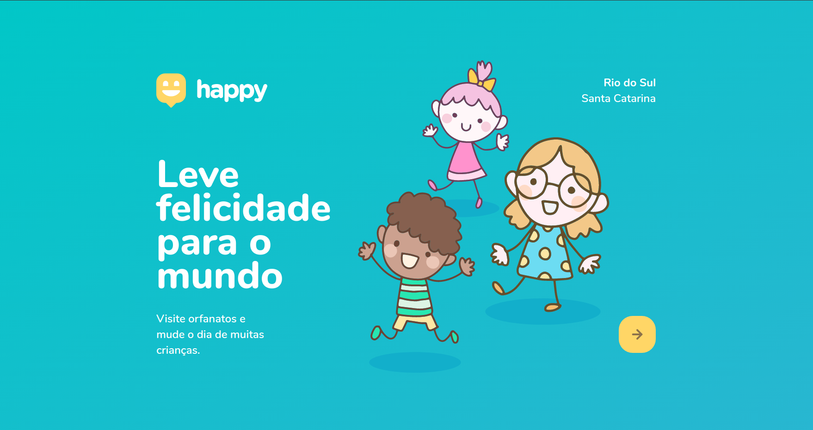

<h1 align="center">
    
</h1>

<h1 align="center">
    
</h1>

## 🚀 Tecnologias

Esse projeto foi desenvolvido utilizando as seguintes tecnologias:

- [Node.js](https://nodejs.org/en/)
- [Express](https://expressjs.com/pt-br/)
- [SQLite](https://www.sqlite.org/index.html)
- [Nunjucks](https://mozilla.github.io/nunjucks/)

## 💻 Projeto

O Happy é um projeto que visa facilitar visitas aos orfanatos próximos a você 💜.

Este é um projeto desenvolvido durante a **[Next Level Week](https://nextlevelweek.com/)**, realizada pela **[@Rocketseat](https://github.com/Rocketseat)** durante os dias 12 à 18 de Outubro de 2020.

## Pré-requisitos

Antes de começar, você vai precisar ter instalado em sua máquina as seguintes ferramentas:

- [Git](https://git-scm.com)
- [Node.js](https://nodejs.org/en/)
- [VSCode](https://code.visualstudio.com/)

## 🎲 Rodando a aplicação

```bash
# Clone este repositório
$ git clone https://github.com/brunagoncalves/happy-discovery.git

# Acesse a pasta do projeto no terminal/cmd
$ cd happy-discovery

# Instale as dependências
$ npm install

# Execute a aplicação
$ npm dev

# O servidor inciará na porta:5000 - acesse <http://localhost:5000>
```

## 📝 Licença

Esse projeto está sob a licença MIT. Veja o arquivo [LICENSE](LICENSE) para mais detalhes.

---

<p align="center">Desenvolvido com 💜 por Bruna Gonçalves durante a semana NLW#3</p>
